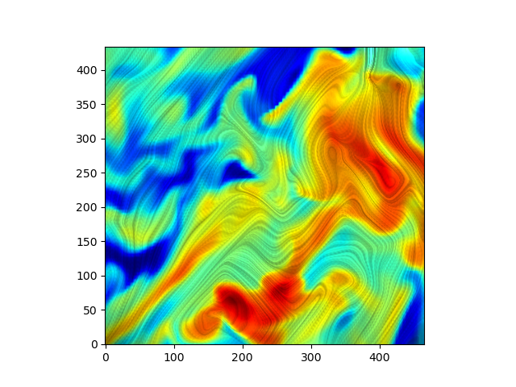

# Line Integral Convolution (LIC) Visualization

A Python implementation of Line Integral Convolution (LIC) for visualizing 2D vector fields, optimized with Numba for high performance.

## Overview

Line Integral Convolution (LIC) is a powerful technique for visualizing vector fields by convolving a noise texture along the streamlines of the vector field. This implementation provides both static visualization and animated output capabilities.

## Features

- **High-performance LIC computation** using Numba JIT compilation
- **Bilinear interpolation** for upsampling vector fields to improve the sharpness of the visualization
- **Static visualization** with customizable color mapping, allowing for better interpretation of vector field and scalar data
- **Animated LIC** generation with MP4 output

## Installation

1. Clone this repository:

```bash
git clone https://github.com/S-Yuan137/LIC.git
cd LIC
```

2. Install the required dependencies:

```bash
pip install -r requirements.txt
```

3. Quickly use the script `lic_numba.py` :
```bash
python lic_numba.py
```

You will see the LIC visualization displayed and saved as an image.



## Usage

### Basic Usage

```python
import numpy as np
from lic_numba import lic_2d, show_color, bilinear_interpolation

# Create sample vector field data or load your own data
rho = np.load("./sample_data/density_sample.npy")
B_x = np.load("./sample_data/Bx_sample.npy")
B_y = np.load("./sample_data/By_sample.npy")

# Upsample the **data**
B_x = bilinear_interpolation(B_x, 5)
B_y = bilinear_interpolation(B_y, 5)
rho = bilinear_interpolation(rho, 5)

# Generate LIC visualization
lic_tex = lic_2d(B_x, B_y, t=0, len_pix=64)

# Display with color mapping
show_color(lic_tex, np.log10(rho))
```

### Generating Animations

```python
from lic_numba import generate_animation

# Generate animated LIC visualization
generate_animation(B_x, B_y, len_pix=5, output_folder="animated_lic")
```

This will create:

- A folder with individual frame images
- An MP4 video file (`animated_lic.mp4`)

## Function Reference

### Core Functions

#### `lic_2d(vector_field_x, vector_field_y, t=0, len_pix=5, noise=None)`

Computes the Line Integral Convolution for a 2D vector field.

**Parameters:**

- `vector_field_x`: X component of the vector field
- `vector_field_y`: Y component of the vector field  
- `t`: Time parameter for animation (default: 0)
- `len_pix`: Length of integration in pixels (default: 5)
- `noise`: Optional custom noise field (auto-generated if None)

**Returns:**

- 2D array containing the LIC texture

#### `bilinear_interpolation(data_in, resample_factor)`

Upsamples 2D data using bilinear interpolation.

**Parameters:**

- `data_in`: Input 2D array
- `resample_factor`: Integer factor to increase resolution

**Returns:**

- Upsampled 2D array

#### `show_color(tex, colorData=None)`

Displays LIC texture with optional color mapping.

**Parameters:**

- `tex`: LIC texture array
- `colorData`: Optional data for color mapping (grayscale if None)

#### `generate_animation(vector_field_x, vector_field_y, len_pix=5, output_folder="animated_lic", noise=None)`

Creates an animated LIC visualization.

**Parameters:**

- `vector_field_x`: X component of vector field
- `vector_field_y`: Y component of vector field
- `len_pix`: Integration length (default: 5)
- `output_folder`: Output directory name (default: "animated_lic")
- `noise`: Optional custom noise field

## Algorithm Details

The LIC algorithm works by:

1. **Normalization**: Vector fields are normalized to unit length
2. **Streamline Integration**: For each pixel, streamlines are traced both forward and backward
3. **Convolution**: Noise values along streamlines are weighted and summed
4. **Weighting**: Cosine-based weighting gives more influence to nearby points

The implementation uses adaptive time stepping to ensure accurate streamline tracing across grid boundaries.

## Performance

- **Numba JIT compilation** provides significant speedup over pure Python
- **Vectorized operations** where possible for additional performance
- **Memory efficient** processing suitable for large datasets

## Data Format

The vector field components should be 2D NumPy arrays of the same shape:

- `vector_field_x[i, j]`: X component at grid point (i, j)
- `vector_field_y[i, j]`: Y component at grid point (i, j)

## Examples

### Custom Noise Pattern

```python
# Create custom binary noise
white_noise = np.random.randint(0, 10, size=B_x.shape)
white_noise = np.where(white_noise < 7, 0, 1).astype(np.float64)

# Use custom noise in LIC
lic_tex = lic_2d(B_x, B_y, noise=white_noise)
```

### Multiple LIC Iterations

```python
# Apply LIC multiple times for smoother results
lic_tex = lic_2d(B_x, B_y, len_pix=64)
for _ in range(2):  # 2 additional iterations
    lic_tex = lic_2d(B_x, B_y, noise=lic_tex)
```

## Dependencies

- **NumPy**: Numerical computations
- **Numba**: JIT compilation for performance
- **Matplotlib**: Visualization and plotting
- **OpenCV**: Video generation and image processing
- **SciPy**: Interpolation functions

## License

This project is open source. Please check the repository for license details.

## Contributing

Contributions are welcome! Please feel free to submit pull requests or open issues for bugs and feature requests.


